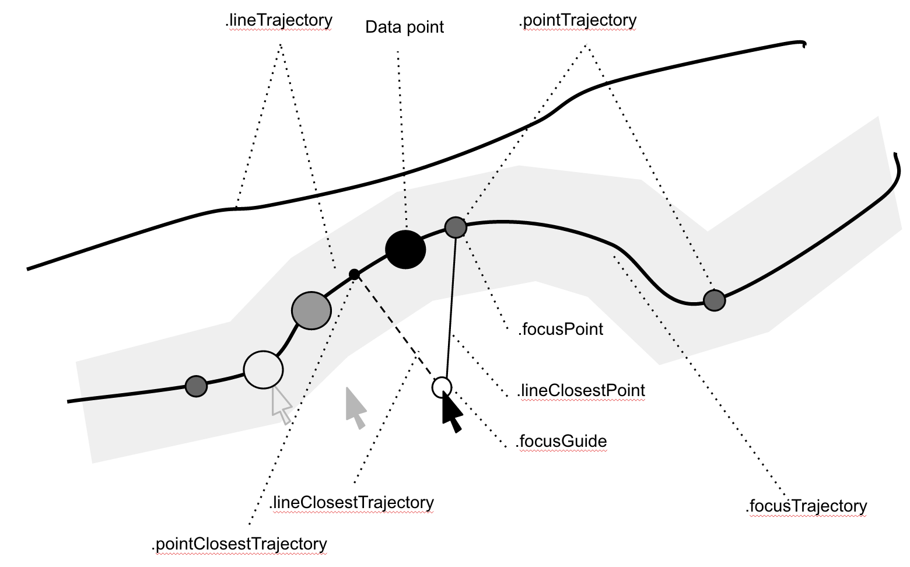
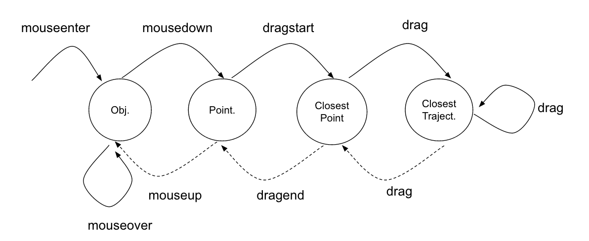

dragit.js
==========

**dragit** is an extension to the **[D3.js](http://d3js.org/)** library to enable the [direct manipulation](https://en.wikipedia.org/wiki/Direct_manipulation_interface) of SVG data visualization. It is designed to be seamlessly included in an existing **D3** visualization. It is also designed to be highly customizable and extensible.

### Publication

Romain Vuillemot, Charles Perin. **Investigating the Direct Manipulation of Ranking Tables.** Proceedings of the 2015 Annual Conference on Human Factors in Computing Systems (CHI 2015), Apr 2015, Seoul, Korea. ACM.

* [Companion demo](http://romain.vuillemot.net/projects/direct-rankings/) for the paper
* [More examples](http://romsson.github.io/dragit/example/) using the same technique

### Examples

#### Simple 

* Single point drag ([demo](http://romsson.github.io/dragit/example/test_single_point.html) | [source](https://github.com/romsson/dragit/blob/master/example/test_single_point.html))
* Multiple points drag ([demo](http://romsson.github.io/dragit/example/test_multi_points.html) | [source](https://github.com/romsson/dragit/blob/master/example/test_multi_points.html))
* Line chart ([demo](http://romsson.github.io/dragit/example/test_linechart.html) | [source](https://github.com/romsson/dragit/blob/master/example/test_linechart.html))
* Spiral shape ([demo](http://romsson.github.io/dragit/example/test_spiral.html) | [source](https://github.com/romsson/dragit/blob/master/example/test_spiral.html))
* Radial tree ([demo](http://romsson.github.io/dragit/example/test_radial_tree.html) | [source](https://github.com/romsson/dragit/blob/master/example/test_radial_tree.html))
* Pan and zoom ([demo](http://romsson.github.io/dragit/example/test_pan_zoom.html) | [source](https://github.com/romsson/dragit/blob/master/example/test_pan_zoom.html))

#### Complex

* Interactive soccer bracket ([demo](http://romain.vuillemot.net/projects/worldcup14/))
* A Re-Recreation of Gapminder's Wealth of Nations ([demo](http://romsson.github.io/dragit/example/nations.html) | [source](https://github.com/romsson/dragit/blob/master/example/nations.html))

#### Coming soon

* Ranking tables
* Standard charts: [Bar chart](http://romsson.github.io/dragit/example/test_barchart.html), pie chart, ..
* Node link diagrams
* Geo maps navigation

### Getting Started

#### Code Organization

One of the library design goal to be included quasi-seamlessly in a current data visualization, i.e. without much change. To use it, insert the following snippets in the header of your code, right after **D3**:

```html
<script src="http://d3js.org/d3.v3.min.js" charset="utf-8"></script>
<script src="dragit.js" charset="utf-8"></script>
```

You are, however, very likely to structure the chart as follows to make sure **dragit** is informed on the existing temporal data and the current state of the visualization. Two functions (names don't matter) are to be created:

* `init()` which is called only once during startup
* `update()` which is called once time has changed

Those two functions will make sure the library's internal state is always up to date, regardless how you update the data visualization (using regular slider or direct manipulation).


#### Core Concepts

Here are a few concepts that are important to grasp:

* **Object (of Interest)**: the graphical marks (SVG node, div, ..) that can be dragged and will indirectly update the visualization.
* **Focus**: the visual element that is being dragged (can be a simplified simplified such as into a point or shadow).
* **Trajectory**: the visual path along which the **Object of Interest** can be dragged. It is represented as a line.
* **Data points**: series of points the focus can reach on the trajectory.

Here are the names using for the various objects:

<p align="center">
	
</p>

### dragit.data

* `dragit.data`: is a time-cube defined where each row are data points and columns time steps.

You may want to generate a random time cube (of `nb_data_points` x `nb_time_steps`). The `x` and `y` values should reflect the exact position of the data poin on screen. Example as below:

```
var timecube = d3.range(nb_data_points).map(function(d, i) {
	return d3.range(nb_time_steps).map(function(e, j) { 
		return {x: i, y: Math.random(), t: j};
	});
})
```

Example (rows are data, columns are time steps):

```
[ d0 [ t0 ] [ t1 ] ... [ tm ] ]
[ d1 [ t0 ] [ t1 ] ... [ tm ] ]
...
[ dn [ t0 ] [ t1 ] ... [ tm ] ]
```

Where d<sub>i</sub> are dimensions, as t<sub>i</sub> are time points.

Some other Ways to generate a dataset that can be dragged:

* Sampling a SVG shapes (see the spiral example)
* Browsing paths of a tree data structure (see the radial tree example or the World Cup Brackets example)
* Image / Video segmentation
* Or more generally, use any other combinatorial space.

### dragit.vars

A series of private variables for internal use. Can be set using publication functions, such as:

* `dragit.init(container)`  :  set the DOM element containing all the trajectories (can be shared with the visualization)   

### dragit.time

* `dragit.time.current` 	: 	the current time (default: 0)
* `dragit.time.min`		    : 	the minimal time point (default: 0)
* `dragit.time.max`		    : 	the maximal time point (default: 0)
* `dragit.time.step`	  	: 	increment (default: 1)
* `dragit.time.speed`		  : 	for the playback (default)

Example:

```
dragit.time = {min: d3.min(data, function(d) { return parseInt(d[i]);}), 
							  max: d3.max(data, function(d) { return parseInt(d[i]);}), 
							  step: 1, 
							  current: 0
							}
```

### dragit.object

The object of interest, or the handle the user interacts with to start the interaction and thus start the time change.

* `dragit.object.activate` activates dragging for the selected element. It creates the necessary mouse events (drag). Example: `.call(dragit.object.activate)`.


#### dragit.object.dragging

* `absolute (default)` does not translate the current chart 
* `relative` does translate the current chart to keep it centered around the current focus point


### dragit.mouse


#### dragit.mouse.dragging

Below are the different `drag-type` strategies:

* `horizontal` or `vertical`
* `flow` flow dragging method. Usually well suited for background * motion.
* `free` dragging with no constraints on the activated element, returns to its original position
* `curvilinear` (not implemented)


#### dragit.mouse.scope

* `focus`		    restricts closest point finding to the current trajectory, thus only change time.
* `selected`		expands the scope to all currently displayed trajectories, thus may change time and the current focus.

### dragit.focus

* Functions related to the focus that is being dragged

### dragit.trajectory

Handles trajectories drawing.

* `dragit.trajectory.display(class)`                   : displays the currently dragged element's trajectory
* `dragit.trajectory.displayUpdate`                    : update the trajectory
* `dragit.trajectory.displayAll(class)`                : displays all trajectories
* `dragit.trajectory.toggle(class)`                    : toggle the display of current trajectory
* `dragit.trajectory.toggleAll(class)`                 : toggle the display of all trajectories
* `dragit.trajectory.remove(class)`                    : removes the created trajectory
* `dragit.trajectory.removeAll(class)`                 : removes all trajectories

### dragit.evt

Events management mechanism to register and trigger functions.

* `dragit.evt.register(event, function, context)`      : register a function for a given `event` or an array of multiple `event` 
* `dragit.evt.call(event)`                             : trigger registered functions

### dragit.statemachine

<p align="center">
	
</p>

* `dragit.statemachine.current_state`                  : the current state of the interaction (e.g mouseenter, dragstart)
* `dragit.statemachine.current_id`                     : the id of the currently manipulated element
* `dragit.statemachine.setState(event)`                : sets the current state of the state machine
* `dragit.statemachine.getState()`                     : gets the current state of the state machine


### dragit.custom

Define the type of design for the focus point `vars.custom_focus` (default) and trajectories `vars.custom_trajectory` (default).

* `dragit.custom.line`
* `dragit.custom.point`


### dragit.constraint

For each object, this allows to set some expected positions when multiple are available. This can be used in multiple scenarios: 

* To filter out a space and only make visible a specific trajectory
* When multiple permutations are possible and we need to decide whiche one

* `dragit.constraint` : array of constraints

### dragit.utils

A collection of useful functions for path calculation and animation.

* `dragit.utils.animateTrajectory(path, star_time, duration)`  : animates the path from start_time and with a given duration
* `dragit.utils.closestPoint`
* `dragit.utils.closestValue`
* `dragit.utils.findYgivenX `
* `dragit.utils.translateAlong(path, duration)`
* `dragit.utils.slider(el, play_button)`  : automatically creates a slider to browse all the time points

